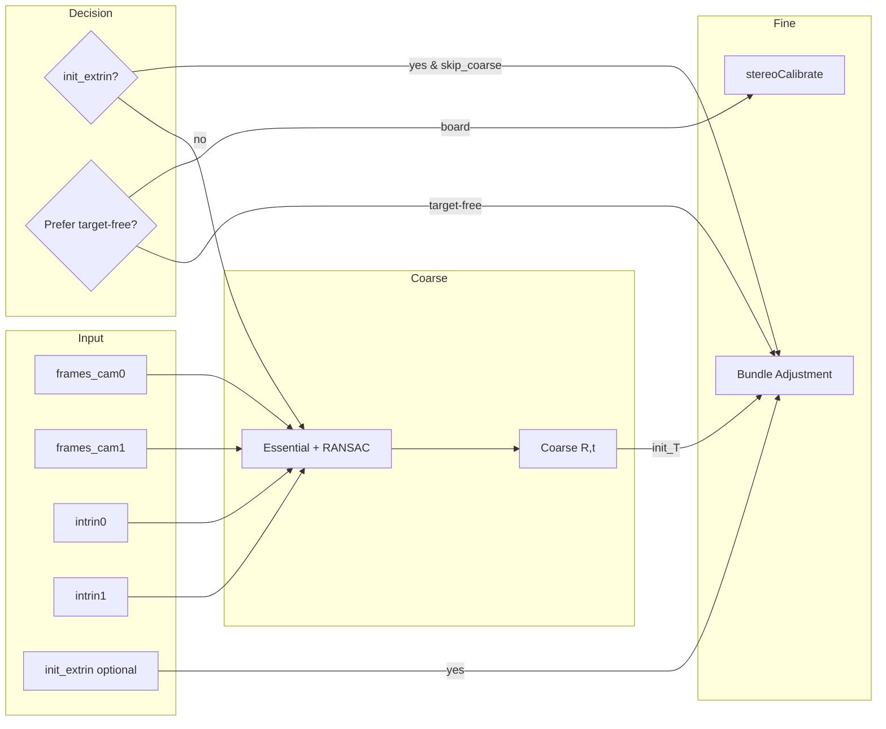

# 相机-相机外参标定算法分析与优化方案

## 0. Executive Summary

| 项目 | 内容 |
|------|------|
| **目标** | 在兼容「标定板法」与「无目标法」、支持「有初值/无初值」的前提下，按近年研究优化相机-相机外参标定算法。 |
| **收益** | 更鲁棒的初始化（5-point/RANSAC 可配）、可选初值加速收敛、标定板与特征法统一入口、可扩展线特征与 certifiable 优化。 |
| **影响** | 新增可选参数与 API 扩展，默认行为保持兼容。 |
| **风险** | 低；初值为可选，无初值时逻辑与现有一致。 |

---

## 1. 背景与目标

### 1.1 当前实现概览

- **粗标定 (Coarse)**：特征匹配（ORB）+ 本质矩阵（`findEssentialMat` + RANSAC）+ `recoverPose`，得到相对位姿（无尺度）。
- **精标定 (Fine)**：
  - **标定板**：`stereoCalibrate`（固定内参），多帧角点。
  - **无目标**：多帧特征匹配 → 三角化 → 两视图 Bundle Adjustment（Ceres），可选尺度约束。
- **初值**：当前仅在两阶段内部使用——粗标定结果作为 BA 初值；粗失败时使用单位 SE3。**没有**「用户/上游给定初值」的入口。

### 1.2 需求拆解

1. **兼容标定板法**：保留并优先在「有标定板且检测成功」时使用 `stereoCalibrate`。
2. **兼容无目标法**：特征匹配 + 本质矩阵 + BA，支持无标定板场景。
3. **有初值**：当存在给定初值（如上一轮标定、SLAM、手测）时，可直接用于 BA 或作为 coarse 的验证/回退。
4. **无初值**：与现有一致，由本质矩阵估计初值，再 BA 精化。
5. **算法优化**：结合近年研究，在初始化鲁棒性、RANSAC、可选线特征与可证明优化等方面做可配置或可扩展改进。

---

## 2. Assumptions & Open Questions

| 假设 | 说明 |
|------|------|
| 内参已知且固定 | 精标定阶段不联合优化内参（可配置 `ba_optimize_intrinsics` 但默认关闭）。 |
| 标定板与无目标二选一或自动选择 | 由 `prefer_targetfree` 或 `method` 决定；若同时有标定板与初值，策略见下节。 |
| 初值为 T_target_in_ref | 与现有 `ExtrinsicSE3` 约定一致（ref=参考相机，target=待标相机）。 |

| 待确认 | 说明 |
|--------|------|
| 是否需「仅用初值 + BA」跳过 coarse | 默认采用：有初值且用户/配置允许时，可跳过本质矩阵粗标定。 |
| 多相机时初值来源 | 当前按对 (id0, id1) 从 params 或配置文件读取；多相机链式初值可后续扩展。 |

---

## 3. 方案设计（含 Trade-off）

### 3.1 统一流程：标定板 + 无目标 + 初值

```
                    ┌─────────────────────────────────────────────────────────┐
                    │                 是否有用户/上游初值？                       │
                    └─────────────────────────────────────────────────────────┘
                                          │
              ┌───────────────────────────┴───────────────────────────┐
              │ 有初值 (init_extrin)                                    │ 无初值
              ▼                                                         ▼
    ┌──────────────────────┐                                ┌──────────────────────┐
    │ 是否优先标定板？       │                                │ 粗标定：特征+本质矩阵  │
    │ (prefer_targetfree=F) │                                │ (Essential + RANSAC) │
    └──────────┬───────────┘                                └──────────┬───────────┘
         │ 是        │ 否                                                │
         ▼           ▼                                                   ▼
    stereoCalibrate  使用初值作为 init_T ────────────────► 精标定：BA 或 标定板
    (标定板)          可选：仍做 coarse 校验                          (init_T = coarse 或 单位)
         │           │
         └───────────┴───────────────────────────────────────────────────┘
                                          │
                    ┌─────────────────────┴─────────────────────┐
                    │ 精标定：BA（两视图/多视图）或 stereoCalibrate │
                    │ 输入 init_T = 初值 / coarse / 单位            │
                    └─────────────────────────────────────────────┘
```

- **有初值 + 标定板**：若 `prefer_targetfree == false`，仍走 `stereoCalibrate`（标定板不依赖初值）；若有标定板结果且希望再精化，可用 BA 以标定板结果为初值（可选）。
- **有初值 + 无目标**：用初值作为 `init_T` 直接进 BA，可选跳过 coarse 或保留 coarse 做一致性检查。
- **无初值**：与现有一致，coarse → BA 或标定板。

### 3.2 算法优化点（基于近年研究）

| 优化项 | 说明 | 实现建议 |
|--------|------|----------|
| **本质矩阵求解** | 5-point 比 8-point 在 RANSAC 中更少点、更稳。OpenCV `findEssentialMat` 在归一化坐标下 RANSAC 时内部可用 5-point。 | 保持归一化坐标调用；将 `method` 设为 `RANSAC`；阈值/置信度可配置（已部分存在，补全到 Config）。 |
| **RANSAC 参数** | 置信度、阈值、最大迭代数影响内点与稳定性。 | 暴露 `ransac_confidence`、`ransac_threshold`、`ransac_max_iter`（部分已有），并设合理默认值。 |
| **Cheirality** | `recoverPose` 依赖正深度；内参/归一化不当会致内点过少。 | 已做内点数量与比例检查；建议日志中输出 cheirality 通过数。 |
| **尺度约束** | 无目标时平移仅 up-to-scale；已知基线或标定板尺寸可固定尺度。 | 已有 `enable_scale_constraint`、`known_baseline_scale`；保持并建议在文档中说明使用场景。 |
| **多视图 BA** | 多相机时全局 BA 比两两链式更一致。 | 已实现 `calibrate_bundle_adjustment_full_multiview`；保持并确保初值可注入（每对 T_cam0_cami 可选初值）。 |
| **线特征 / 可证明优化** | 近年工作（如 PeLiCal 线特征、certifiable 优化）适合大基线、弱纹理。 | 文档中列为后续扩展；接口预留（如 `use_line_features` 配置占位）。 |

### 3.3 初值使用策略

| 场景 | 行为 |
|------|------|
| 有初值 + 选择「用初值且跳过 coarse」 | 直接 `init_T = init_extrin.SE3()`，进精标定（BA 或标定板）。 |
| 有初值 + 选择「仍做 coarse」 | 先 coarse；若 coarse 成功则 `init_T = coarse`（与现一致）；若失败则 `init_T = init_extrin.SE3()`。 |
| 无初值 | `init_T = coarse` 或单位阵（与现一致）。 |

推荐默认：**有初值时跳过 coarse**，减少计算并避免 coarse 在困难场景下把好初值带偏。

---

## 4. 变更清单（文件/模块/接口）

| 文件 | 变更类型 | 说明 |
|------|----------|------|
| `include/unicalib/extrinsic/cam_cam_calib.h` | 修改 | 增加 `calibrate_two_stage(..., optional<ExtrinsicSE3> init_extrin)`；Config 增加 `use_initial_if_available`、`skip_coarse_when_initial_given`；RANSAC 相关参数补全。 |
| `src/extrinsic/cam_cam_calib.cpp` | 修改 | 两阶段内根据 `init_extrin` 决定是否做 coarse、`init_T` 来源；本质矩阵分支使用 Config 中 RANSAC 参数；多视图 BA 支持可选初值（从 vector 传入）。 |
| `include/unicalib/pipeline/calib_pipeline.h` | 修改 | 无（或仅增加「是否传入初值」的说明）。 |
| `src/pipeline/calib_pipeline.cpp` | 修改 | `run_fine_cam_cam` 中，若 params 已有 (id0, id1) 外参且配置允许，则作为 `init_extrin` 传入 `calibrate_two_stage`。 |
| `config/unicalib_example.yaml` | 修改 | `cam_cam` 下增加 `use_initial_if_available`、`skip_coarse_when_initial_given` 及 RANSAC 注释。 |
| `docs/CAM_CAM_EXTRINSIC_ALGORITHM_AND_OPTIMIZATION.md` | 新增 | 本文档。 |

---

## 5. 接口与配置（关键片段）

### 5.1 两阶段接口（支持可选初值）

```cpp
// 现有
TwoStageResult calibrate_two_stage(
    const std::vector<std::pair<double, cv::Mat>>& frames_cam0,
    const std::vector<std::pair<double, cv::Mat>>& frames_cam1,
    const CameraIntrinsics& intrin0,
    const CameraIntrinsics& intrin1,
    bool prefer_targetfree = true,
    const std::string& cam0_id = "cam_0",
    const std::string& cam1_id = "cam_1");

// 扩展：增加可选初值
TwoStageResult calibrate_two_stage(
    const std::vector<std::pair<double, cv::Mat>>& frames_cam0,
    const std::vector<std::pair<double, cv::Mat>>& frames_cam1,
    const CameraIntrinsics& intrin0,
    const CameraIntrinsics& intrin1,
    bool prefer_targetfree = true,
    const std::string& cam0_id = "cam_0",
    const std::string& cam1_id = "cam_1",
    std::optional<ExtrinsicSE3> init_extrin = std::nullopt);
```

### 5.2 Config 新增/补全

```cpp
// RANSAC（补全并用于 findEssentialMat / recoverPose）
double ransac_confidence = 0.999;   // 已有 threshold，补 confidence
int    ransac_max_iter   = 1000;    // 已有

// 初值策略
bool use_initial_if_available      = true;   // 若调用方传入 init_extrin 则使用
bool skip_coarse_when_initial_given = true; // 有初值时是否跳过粗标定
```

### 5.3 Pipeline 传入初值

在 `run_fine_cam_cam` 的 `run_pair` 内：

- 若 `params_->get_extrinsic(id0, id1)` 已有且有效，且配置 `use_initial_if_available`（或 pipeline 级等价配置）为 true，则将该外参作为 `init_extrin` 传入 `calibrate_two_stage`。

---

## 6. Mermaid：数据流与初值



---

## 7. 编译/部署/运行说明

- 与现有 UniCalib 一致：CMake 配置、依赖（OpenCV、Ceres、Sophus）不变。
- 运行示例（相机-相机精标定，使用 bag）：
  ```bash
  ./bin/unicalib_joint --config config/unicalib_example.yaml --task cam-cam
  ```
- 若 params 或结果目录中已有某对相机外参，新逻辑下将自动作为初值使用（可配置关闭）。

---

## 8. 验证与回归

| 项 | 方法 |
|----|------|
| 无初值 + 标定板 | 与现有行为一致：多帧棋盘格 → stereoCalibrate，RMS 与现结果可比。 |
| 无初值 + 无目标 | 多帧特征 → Essential → BA，与现有无初值流程一致。 |
| 有初值 + 无目标 | 提供初值 YAML 或 params，跑两阶段；应得到与初值接近或更优的外参，且可配置下跳过 coarse。 |
| 有初值 + 标定板 | 有初值仍走标定板时，结果应以标定板为准；可选 BA 精化时以标定板结果为初值。 |

---

## 9. 风险与回滚

| 风险 | 缓解 | 回滚 |
|------|------|------|
| 初值质量差导致 BA 收敛到局部最优 | 可配置「有初值仍做 coarse」作校验或替换。 | 配置 `skip_coarse_when_initial_given=false` 或关闭 `use_initial_if_available`。 |
| Pipeline 误用旧外参作为初值 | 仅当显式开启「使用已有外参作初值」且该外参存在时注入。 | 关闭对应配置或清空该对的外参。 |

---

## 10. 后续演进（MVP → V1 → V2）

| 阶段 | 内容 |
|------|------|
| **MVP（本次）** | 可选初值 API、两阶段与 pipeline 初值贯通、RANSAC/初值策略可配置、标定板与无目标统一流程说明。 |
| **V1** | 5-point 显式选项（若 OpenCV 版本支持）、多视图 BA 初值按对传入、日志中 cheirality 通过数。 |
| **V2** | 线特征约束（PeLiCal 类）、certifiable 相对位姿优化参考、宽基线场景的 eWand/多相机标定扩展。 |

---

## 参考文献与术语

- **本质矩阵 E**：满足 `x2'^T E x1 = 0`，E = [t]_× R；5-point 为最小解，8-point 为线性解。
- **Cheirality**：重建点必须在两相机前方（正深度）。
- **RAVES-Calib**：Robust, Accurate and Versatile Extrinsic Self Calibration（2D-3D 与线特征、自适应权重）。
- **PeLiCal**：线特征、收敛投票、无目标实时标定。
- **Certifiable optimization**：带数学保证的优化，用于在线外参标定。
