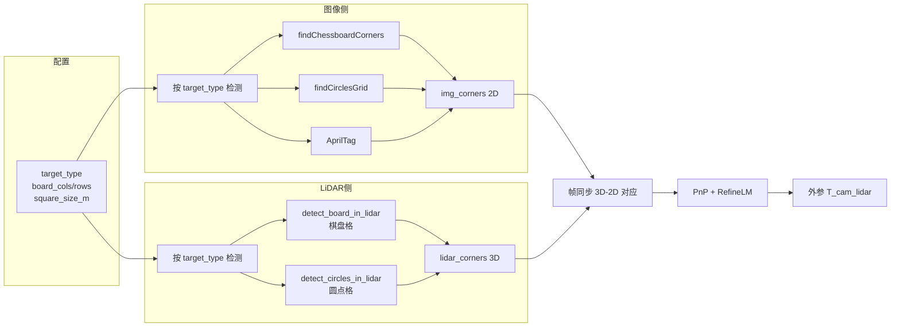

# LiDAR-相机标定：标定板支持分析与兼容方案

## 0. Executive Summary

| 结论 | 说明 |
|------|------|
| **已支持** | **棋盘格（chessboard）**、**圆点格对称（circles_grid）**、**圆点格非对称（asym_circles）** 均可通过配置选择。 |
| **配置方式** | 在 YAML 的 `lidar_camera` 下设置 `target_type: chessboard`（默认）或 `circles_grid` 或 `asym_circles`，配合 `board_cols`/`board_rows`/`square_size` 即可。 |
| **未支持** | AprilTag/ArUco 暂未接入，可作后续扩展。 |

**收益**：圆点板抗模糊/光照、AprilTag 提供唯一 ID 与亚像素角点，可提升鲁棒性与多板/大场景标定。  
**代价**：需新增/复用图像检测、LiDAR 端各类型检测逻辑与配置解析，并做回归测试。

---

## 圆点格参数说明（对称 vs 非对称）

| 参数 | 对称圆点格 (circles_grid) | 非对称圆点格 (asym_circles) |
|------|---------------------------|------------------------------|
| **board_cols** | 列数（圆心数） | 列数（通常为**奇数**，与 OpenCV 约定一致） |
| **board_rows** | 行数 | 行数（通常为**偶数**） |
| **square_size_m** | 圆心间距 [m]，x、y 方向相同 | **行方向**圆心间距 [m]；列方向为交错布局（见下） |
| **更多参数** | **不需要**。一格尺寸即可。 | **不需要**。OpenCV 约定：行间距 = `square_size_m`，列方向为交错（奇偶行错开半个间距），由公式 `x=(2*c+r%2)*s, y=r*s` 确定 3D 点。 |

- **对称**：规则矩形网格，`square_size_m` = 相邻圆心间距（横竖一致）。
- **非对称**：奇偶行错开，`square_size_m` = 行间距（也是“小”间距）；列方向相邻圆心间距为 `2*square_size_m` 与错位关系。标定板制作时需与 OpenCV 的 [Create Calibration Pattern](https://docs.opencv.org/4.x/da/d0d/tutorial_camera_calibration_pattern.html) 或常见“非对称圆点板”一致。
- **可选**：若需在 LiDAR 端按圆尺寸过滤或精化，可增加可选参数 **circle_diameter_m**（圆直径 [m]），当前实现未强制要求。

---

## 1. 当前实现：标定板支持情况

### 1.1 已支持：棋盘格（Chessboard）

- **方法枚举**：`LiDARCameraCalibrator::Method::TARGET_CHESSBOARD`。
- **配置**：`board_cols`、`board_rows`、`square_size_m`（见 `lidar_camera_calib.h` Config）。
- **图像侧**（`lidar_camera_calib.cpp`）：
  - `cv::Size pattern_size(cfg_.board_cols, cfg_.board_rows)`
  - `cv::findChessboardCorners` + `cv::cornerSubPix` → `img_corners`。
- **LiDAR 侧**：`detect_board_in_lidar()`：
  - 体素下采样 → RANSAC 平面 → 平面内点投影 2D → 按 `board_cols/rows`、`square_size_m` 生成角点网格 → 强度梯度精化 → 输出 `corners_3d`。
- **求解**：3D（LiDAR 系）与 2D（图像）一一对应后 `solvePnPRansac` + `solvePnPRefineLM` → 外参。

因此，**标定板在「棋盘格」意义上已支持**；约束是：标定板必须同时在图像和点云中可检测（点云需有足够平面点与强度对比）。

### 1.2 未支持：其他标定板类型

| 类型 | 相机内参 / cam_cam | LiDAR-相机 |
|------|--------------------|------------|
| 棋盘格 | ✅ TargetConfig::CHESSBOARD | ✅ TARGET_CHESSBOARD |
| 圆点格对称 | ✅ CIRCLES_GRID | ❌ 无 |
| 圆点格非对称 | ✅ ASYMMETRIC_CIRCLES | ❌ 无 |
| AprilTag/ArUco | thirdparty 有 AprilGrid，主流程未统一 | ❌ 无 |

- 相机内参里已有 `TargetConfig::Type`（CHESSBOARD / CIRCLES_GRID / ASYMMETRIC_CIRCLES）和 `object_points()`；cam_cam 使用 `cfg_.target`。
- LiDAR-相机模块**没有** `target_type` 或类似枚举，仅写死棋盘格逻辑。

---

## 2. 需求与假设

- **需求**：在不破坏现有棋盘格流程的前提下，支持圆点格、可选支持 AprilTag/ArUco，便于不同场地与精度需求。
- **假设**：
  - 标定板在 LiDAR 视野内可被扫到（平面 + 一定点密度）；
  - 圆点/AprilTag 在点云中的可区分性通过几何（圆心/边缘）或强度/形状实现；
  - 配置与相机内参/cam_cam 的 target 概念对齐，便于 joint 与统一 YAML。

---

## 3. 方案对比与取舍

| 方案 | 描述 | 优点 | 缺点 |
|------|------|------|------|
| A. 仅文档说明 | 仅声明当前只支持棋盘格 | 无开发量 | 无法满足圆点/AprilTag 需求 |
| B. 抽象 target 类型 + 多类型实现 | 引入 TargetType 枚举，图像/LiDAR 双端按类型分支 | 与内参/cam_cam 一致，易扩展 | 需实现 LiDAR 端圆点/AprilTag 检测 |
| C. 仅图像侧多类型 + LiDAR 仅棋盘格 | 图像侧支持 circles/AprilTag，LiDAR 仍只做棋盘格 | 实现量小 | LiDAR 端 3D 点仍依赖棋盘格检测，类型不一致时失败 |

**取舍**：推荐 **B**。先做 **棋盘格 + 圆点格** 双类型，AprilTag 作为可选扩展（可先做图像侧 + 已知 3D 模板的 PnP，LiDAR 端用平面+四个角点或后续再补）。

---

## 4. 设计细节：兼容多种标定板

### 4.1 配置与枚举

- 在 `LiDARCameraCalibrator::Config` 中增加标定板类型与统一尺寸参数，与 `TargetConfig` 对齐：

```cpp
// 标定板类型（与 TargetConfig 对齐，便于 joint/配置统一）
enum class TargetType {
    CHESSBOARD,
    CIRCLES_GRID,
    ASYMMETRIC_CIRCLES,
    APRILTAG_GRID   // 可选，后续扩展
};

struct Config {
    // 现有
    Method method = Method::TARGET_CHESSBOARD;
    int board_cols = 9, board_rows = 6;
    double square_size_m = 0.025;

    // 新增：标定板类型（默认棋盘格，保持兼容）
    TargetType target_type = TargetType::CHESSBOARD;

    // 圆点格：与 TargetConfig 一致时，可用 square_size_m 表示圆心间距
    // AprilTag：可选 tag_size_m, tag_spacing 等
};
```

- YAML 示例（与现有 `board_cols/board_rows` 兼容）：

```yaml
lidar_camera:
  method: target
  target_type: chessboard   # chessboard | circles_grid | asym_circles | apriltag
  board_cols: 9
  board_rows: 6
  square_size_m: 0.025
```

### 4.2 图像侧：按类型检测 2D 点

- 抽象出「按类型检测图像角点」函数，返回 `std::vector<cv::Point2f>` 与顺序与 3D 模板一致：
  - `CHESSBOARD`：现有 `findChessboardCorners` + `cornerSubPix`。
  - `CIRCLES_GRID`：`cv::findCirclesGrid(..., CALIB_CB_SYMMETRIC_GRID)`。
  - `ASYMMETRIC_CIRCLES`：`cv::findCirclesGrid(..., CALIB_CB_ASYMMETRIC_GRID)`。
  - `APRILTAG_GRID`：使用 thirdparty 的 AprilTag 检测，输出角点顺序与预定义 3D 模板一致（可选后续实现）。

- 与现有 `calibrate_target()` 的兼容方式：在 `calibrate_target()` 内根据 `cfg_.target_type` 分支调用上述检测，得到 `img_corners`；后续 3D-2D 对应与 PnP 不变。

### 4.3 LiDAR 侧：按类型检测 3D 点

- **棋盘格**：保持现有 `detect_board_in_lidar()`（平面 + 强度网格角点）。
- **圆点格**：
  - 复用现有「体素下采样 + RANSAC 平面 + 平面内点投影 2D」；
  - 在 2D 平面内做「圆检测」或「强度/几何圆心」估计，得到圆心在平面上的 2D 位置，再反投影到 LiDAR 3D；
  - 圆点格在点云中通常为「高反射圆」或「平面上的圆洞」，可通过强度环或边缘拟合圆心。
- **AprilTag**：
  - 方案 1：仅用图像 AprilTag 检测到的角点 3D 化：若已知标定板在平面上的位姿，可由平面方程 + 2D 反投影得到 3D（需要已知外参初值，适合精化）；
  - 方案 2：在点云中检测矩形/四个角点（平面内找边界框或高梯度角点），与图像 tag 角点通过顺序或 ID 对应（实现量大，可放 V2）。

建议 **MVP**：仅实现 **棋盘格 + 圆点格**；圆点格在 LiDAR 端用「平面 + 2D 圆检测/强度质心」得到圆心 3D 点。

### 4.4 3D 模板与顺序一致性

- 棋盘格：当前 LiDAR 与图像都按 `(board_cols, board_rows)` 的同一顺序生成角点，顺序一致。
- 圆点格：需保证 `object_points()` 与 OpenCV `findCirclesGrid` 的角点顺序一致（与 `TargetConfig::object_points()` 的 CIRCLES_GRID/ASYMMETRIC_CIRCLES 逻辑一致）；LiDAR 端圆心顺序需与图像侧对齐（例如按 u/v 排序，与相机内参一致）。

### 4.5 数据流（Mermaid）



---

## 5. 变更清单（建议）

| 文件/模块 | 变更内容 |
|-----------|----------|
| `include/unicalib/extrinsic/lidar_camera_calib.h` | 增加 `TargetType` 枚举、`Config::target_type`；可选 `detect_circles_in_lidar` 声明。 |
| `src/extrinsic/lidar_camera_calib.cpp` | 图像侧：按 `target_type` 分支调用 findChessboardCorners / findCirclesGrid；LiDAR 侧：`detect_board_in_lidar` 仅棋盘格，新增 `detect_circles_in_lidar`（平面+圆检测）；`calibrate_target()` 内根据类型选择 LiDAR 检测并保证 3D-2D 顺序一致。 |
| `apps/lidar_camera_extrin/main.cpp` | 从 YAML 读取 `target_type`，映射到 `TargetType`。 |
| `apps/joint_calib/main.cpp` | 若已有 `target_type`，同步到 `lidar_cam_cfg.target_type`。 |
| `config/unicalib_example.yaml` | 增加 `lidar_camera.target_type` 示例与注释。 |
| 文档 | 本说明 + README 中「标定板类型」说明。 |

---

## 6. 编译 / 运行说明（与现有一致）

- 构建：现有 CMake 与依赖不变；若将来接入 AprilTag，需启用对应 thirdparty。
- 运行：`--method target` 时，若未配置 `target_type`，默认 `chessboard`，行为与当前一致。
- 验证：使用现有棋盘格数据跑通后，用圆点格数据（同场景 LiDAR+图像）验证圆点格分支。

---

## 7. 验证与回归

- 单元/集成：现有 `lidar_camera_calib` 的棋盘格测试保持不变；新增「target_type=chessboard 时行为与原逻辑一致」的断言或回归用例。
- 圆点格：准备至少一组「圆点格标定板 + 同步 LiDAR/图像」，检查 3D-2D 对应数量与 PnP RMS。
- 文档：在 README 或 LIDAR_CAM_CALIB_ACCURACY 中注明：标定板类型、推荐用法（棋盘格 vs 圆点格 vs 无标定板边缘对齐）。

---

## 8. 风险与回滚

- 风险：LiDAR 端圆点检测在低分辨率/低反射场景下可能不稳定；新分支增加维护成本。
- 回滚：`target_type` 默认 `CHESSBOARD`，所有新分支可通过配置关闭；保留原 `detect_board_in_lidar` 接口不变，圆点逻辑独立函数。

---

## 9. 后续演进（MVP → V1 → V2）

| 阶段 | 内容 |
|------|------|
| MVP | 配置层增加 `target_type`，图像侧支持 `chessboard` + `circles_grid`/`asym_circles`；LiDAR 侧保留棋盘格，圆点格可先做「仅图像圆点 + 已知平面/初值」或简单圆心检测。 |
| V1 | LiDAR 端完整实现圆点格检测（平面 + 圆/强度质心），与图像顺序对齐；joint 与 YAML 统一读取 `target_type`。 |
| V2 | AprilTag 图像侧接入 + 3D 由平面/初值反投影或点云角点检测；多板/大场景支持。 |

---

## 10. 小结

- **是否支持标定板**：支持，当前为**棋盘格**一种。
- **如何兼容**：引入 **target_type**，图像侧复用或实现 findCirclesGrid（及可选 AprilTag），LiDAR 侧保留棋盘格并新增圆点格检测，配置与内参/cam_cam 对齐，保证 3D-2D 顺序一致后沿用现有 PnP 流程即可。
