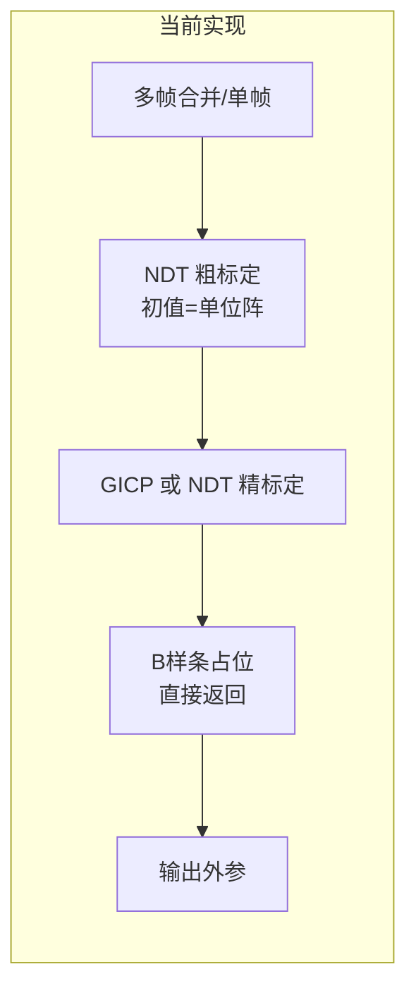
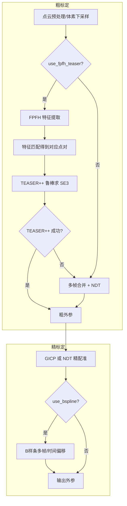
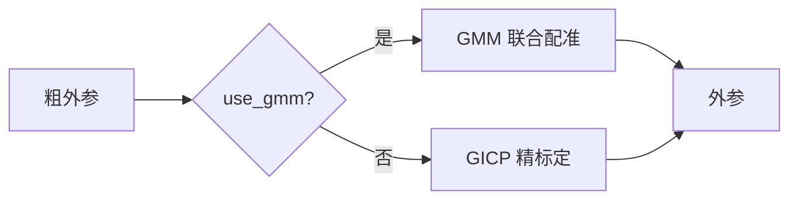

# LiDAR-LiDAR 外参标定算法分析与优化方案

## 0. Executive Summary

| 项目 | 结论 |
|------|------|
| **当前实现** | 头文件描述「FPFH + TEASER++ / GMM → GICP / B样条」两阶段流程，**实现上粗/精标定均退化为 NDT/GICP**，FPFH、TEASER++、GMM、B样条均为占位，无初值时 NDT 从单位阵起步易陷入局部最优。 |
| **收益** | 补齐特征粗对齐 + 鲁棒匹配 + 可选 GMM 联合配准 + 多帧 B样条精化，可提升无初值/大偏差场景的收敛率与精度（目标 &lt;3 cm 平移、&lt;0.5° 旋转）。 |
| **风险** | 新增 TEASER++/GMM 依赖与算力；需保留 NDT 单路径作为回退与无重叠 FOV 的替代方案。 |

---

## 1. 背景与目标

### 1.1 需求拆解

- **主流程**：多 LiDAR 间外参 T_target_in_ref 的估计，支持 targetless（无标定板）、可选 motion-based（运动约束）。
- **约束**：FOV 部分重叠即可；无初值时需粗对齐再精配准；动态场景需时间对齐与轨迹平滑。
- **精度目标**：平移 &lt;3 cm、旋转 &lt;0.5°（与头文件及文献一致）。

### 1.2 术语表（Glossary）

| 术语 | 含义 |
|------|------|
| 粗标定 (Coarse) | 无/差初值下的初始 SE3 估计，需大收敛域、抗 outlier。 |
| 精标定 (Fine) | 在粗标定附近做点-面/概率配准，提高精度。 |
| FPFH | Fast Point Feature Histograms，快速点特征直方图，用于几何描述子匹配。 |
| TEASER++ | 截断最小二乘 + 半定松弛，鲁棒求解旋转/平移，抗高比例 outlier。 |
| GMM 联合配准 | 多源点云用高斯混合模型联合优化，无单一参考帧偏置。 |
| GICP | Generalized ICP，点-面/协方差形式，精配常用。 |
| NDT | Normal Distributions Transform，体素正态分布，对初值相对宽容。 |

---

## 2. 当前实现与设计差距

### 2.1 设计意图（头文件 / 注释）

两阶段流程（见 `include/unicalib/extrinsic/lidar_lidar_calib.h`）：

- **粗标定**：FPFH 特征 → TEASER++ 鲁棒匹配 → 可选 GMM 联合配准。
- **精标定**：GICP 精细配准 → 可选 B样条多帧联合 + 时间偏移优化。
- **参考文献**：Multi-LiCa (TUM 2024, arXiv:2501.11088)、GMMCalib (2024, arXiv:2404.03427)。

### 2.2 实际实现（源码）

| 模块 | 设计 | 实际实现 | 位置 |
|------|------|----------|------|
| 粗标定 | FPFH + TEASER++ 或 GMM | **仅 NDT**：单帧或多帧合并后 NDT，初值为单位阵 | `calibrate_fpfh_teaser` → 内部调 `calibrate_ndt(..., SE3d())`；`calibrate_gmm` → 合并点云后 NDT |
| FPFH | 提取描述子 | `compute_fpfh_features` 固定返回 false | `lidar_lidar_calib.cpp` |
| TEASER++ | 鲁棒位姿估计 | `solve_teaser` 固定返回 nullopt | 同上 |
| GMM | 联合配准 | `initialize_gmm` / `optimize_multi_frame` 返回 false；GMM 路径实际是「合并+NDT」 | 同上 |
| 精标定 | GICP / NDT + B样条 | GICP 或 NDT 多帧合并后单次配准；**B样条为占位**，直接返回输入外参 | `calibrate_fine`、`refine_with_bspline` |
| 可观测性 | 重叠率与推荐方法 | `analyze_observability` 返回固定值，未真实计算重叠 | 同上 |

结论：**当前等价于「多帧合并 + NDT 粗 + GICP/NDT 精」**，无特征匹配、无鲁棒匹配、无 GMM、无多帧轨迹精化，在无初值或大偏差下易失败或陷入局部最优。

---

## 3. 最新研究要点与启示

### 3.1 Multi-LiCa (TUM 2025, arXiv:2501.11088)

- **思想**：无运动、无标定板、无需初值的多 LiDAR 外参标定。
- **流程**：**特征匹配粗对齐 + GICP 精配**，结合 **cost-based 匹配策略**。
- **启示**：粗对齐必须「特征 + 鲁棒位姿估计」才能无初值泛化；精配 GICP 与当前一致，可保留并加强多帧与时间一致性。

### 3.2 GMMCalib (TUM 2024, arXiv:2404.03427)

- **思想**：GMM 联合配准，多观测联合优化到潜在几何模型，**不指定单一参考帧**，减少 pair-wise ICP 的偏置与局部极小。
- **结果**：在仿真与实车（立方体标定物）上，相比 Point/Plane/GICP 的 miscalibration 更少，欧拉角与平移误差更稳。
- **启示**：在有多帧/多视角且算力允许时，GMM 可作为粗标定后的可选精化或替代精标定路径，尤其适合 target-based 或高重叠 targetless。

### 3.3 TEASER++ (MIT SPARK, 2020+)

- **能力**：截断最小二乘 + 半定松弛，**旋转/平移可证最优**，抗极高 outlier 比例（文献称可达 99%）。
- **与点云流程**：先由 FPFH（或其它）建立对应点对，再用 TEASER++ 从带 outlier 的对应中鲁棒估计 SE3。
- **启示**：粗标定阶段用「FPFH 对应 + TEASER++」替代「仅 NDT 从单位阵」可显著提高无初值、大偏差、多 outlier 场景的成功率。

### 3.4 小结：算法演进优先级

| 优先级 | 方向 | 依据 |
|--------|------|------|
| P0 | 粗标定：FPFH + TEASER++ 实现并作为默认粗路径 | 无初值、大偏差、Multi-LiCa 与工业实践一致 |
| P1 | 精标定：保留/强化 GICP，多帧逐帧或加权融合 | 与 Multi-LiCa 精配一致，实现成本低 |
| P2 | 可选 GMM 联合配准（粗后精化或替代精标定） | GMMCalib 证明稳健性，算力与接口可后置 |
| P3 | B样条多帧 + 时间偏移优化 | 动态场景、时间未对齐时有用，接口已预留 |

---

## 4. 方案设计（含 Trade-off）

### 4.1 粗标定：特征 + 鲁棒位姿

- **方案 A（推荐）**：实现 FPFH + TEASER++ 作为主粗路径；保留「多帧合并 + NDT」作为回退或 `use_fpfh_teaser=false` 时的路径。
- **方案 B**：仅多尺度 NDT（先大体素后小体素）做粗对齐。  
- **Trade-off**：A 需引入 PCL FPFH + TEASER++ 依赖（C++/Python 库），但无初值鲁棒性明显优于 B；B 实现简单但大偏差易失败。

### 4.2 精标定：GICP 为主，可选多帧

- 保持当前 GICP/NDT 二选一；**增强**：支持多帧逐帧 GICP 后中值/加权平均，或按 `fitness_score` 筛选帧再融合，降低单帧噪声影响。
- B样条：实现「多帧位姿 + 时间戳 → B样条轨迹 → 约束外参/时间偏移」的轻量版本（可先固定外参仅优化时间偏移），或延后到 V2。

### 4.3 GMM 联合配准

- **选项 1**：集成 GMMCalib 或 JRMPC 风格联合配准，作为配置项（如 `use_gmm_registration=true`）在粗标定之后运行，输出替代/精化外参。
- **选项 2**：仅接口与配置预留，实现延后；先闭环 FPFH+TEASER++ + GICP 多帧。

建议：**先 P0+P1，GMM 与 B样条作为 P2/P3 分阶段落地。**

### 4.4 可观测性

- `analyze_observability`：用当前粗外参（或零/机械初值）将两路点云变换到同一帧，基于体素或距离阈值**真实计算重叠率**；根据重叠率推荐 targetless / motion / 级联标定，并给出 `needs_manual` 等诊断。

---

## 5. 变更清单（文件/模块/接口）

| 文件/模块 | 变更类型 | 说明 |
|-----------|----------|------|
| `include/unicalib/extrinsic/lidar_lidar_calib.h` | 配置/可选 | 增加 `use_fpfh_teaser_coarse`（默认 true）、`teaser_*` 参数透传；GMM/B样条保持可选。 |
| `src/extrinsic/lidar_lidar_calib.cpp` | 实现 | 实现 `compute_fpfh_features`（PCL）、`solve_teaser`（TEASER++ 或子模块）；`calibrate_fpfh_teaser` 真正走 FPFH→对应→TEASER++；`calibrate_coarse` 在无 init 时优先 FPFH+TEASER++，失败或关闭时回退 NDT；`analyze_observability` 基于重叠率计算。 |
| 第三方/CMake | 依赖 | 可选 TEASER++（或 conda/vcpkg），PCL 已有；若 TEASER++ 不可用，编译时回退到仅 NDT 粗标定。 |
| `config/unicalib_example.yaml` | 配置 | `lidar_lidar.coarse` 下增加 `use_fpfh_teaser: true`、`teaser_noise_bound` 等，与现有 `fpfh_radius` 等一致。 |

---

## 6. 算法流程图（Mermaid）

### 6.1 当前实际流程

### 6.2 目标两阶段流程（优化后）

### 6.3 可选 GMM 路径（P2）

---

## 7. 编译/部署/运行说明

- **环境**：现有 CMake + PCL；若启用 TEASER++，需安装 TEASER++（如 `vcpkg install teaserplusplus` 或项目子模块）并在 CMake 中 `find_package(TEASER++)`，未找到时自动关闭 `use_fpfh_teaser` 或编译选项关闭。
- **运行**：不变，`unicalib_lidar_lidar --config unicalib_example.yaml`；数据与 `lidar_lidar.pairs`、`data.lidar.<id>` 配置方式不变。
- **配置**：在 `lidar_lidar.coarse` 中增加 `use_fpfh_teaser: true`、`teaser_noise_bound: 0.1` 等；默认保持与现有行为兼容（可默认 `use_fpfh_teaser: false` 直至实现稳定）。

---

## 8. 验证与回归

- **单测**：现有 `test_lidar_lidar_calib.cpp` 保留；新增用例：mock 两片点云（已知 GT 外参），验证 FPFH+TEASER++ 粗标定在无初值下得到接近 GT 的 SE3（误差 &lt; 阈值）；验证回退 NDT 路径仍可通过。
- **集成**：跑通 `lidar_lidar_extrin` 与 pipeline 中 `LIDAR_LIDAR_EXTRIN`，检查输出 YAML 与可视化。
- **回归**：同一份数据，对比「仅 NDT 粗」与「FPFH+TEASER++ 粗」的收敛率与最终精度（有 GT 时用平移/旋转误差；无 GT 用 overlap_ratio / fitness_score）。

---

## 9. 风险与回滚

- **风险**：TEASER++ 依赖、编译环境差异；FPFH 在极稀疏/重复结构场景可能匹配率低。
- **缓解**：粗标定保留 NDT 回退；配置项 `use_fpfh_teaser` 可关闭；可观测性分析提示重叠不足时建议提供初值或 motion 数据。
- **回滚**：设置 `use_fpfh_teaser: false` 即回退到当前「合并+NDT+GICP」行为；不改变 `ExtrinsicSE3` 等对外接口。

---

## 10. 后续演进路线（MVP → V1 → V2）与当前实现状态

| 阶段 | 内容 | 验收 | 状态 |
|------|------|------|------|
| **P0/MVP** | FPFH + 鲁棒位姿(RANSAC) 粗标定，可配置、失败回退 NDT | 无初值粗标定成功率提升 | **已实现**：`use_fpfh_teaser_coarse`、`calibrate_fpfh_teaser`、`solve_teaser`(RANSAC)，`coarse_method` 上报 FPFH_RANSAC/GMM/NDT |
| **P1** | 多帧 GICP 融合（median/weighted） | 精标定稳定性提升 | **已实现**：`use_multi_frame_fine`、`fine_fusion_method`(median/weighted/single) |
| **P2** | GMM 联合配准（接口+开关） | 可选 GMM 精化 | **接口预留**：`use_gmm_registration`(默认 false)，`calibrate_gmm` 当前为合并+NDT |
| **P3** | B样条多帧+时间偏移 | 动态场景时间对齐 | **占位**：`refine_with_bspline` 直接返回当前外参 |
| **V2** | `analyze_observability` 真实重叠率；无重叠 FOV 级联/运动 | 可观测性诊断与无重叠标定 | 待实现 |

---

## 参考文献

- [1] Multi-LiCa: A Motion and Targetless Multi LiDAR-to-LiDAR Calibration Framework. arXiv:2501.11088 (2025).
- [2] GMMCalib: Extrinsic Calibration of LiDAR Sensors using GMM-based Joint Registration. arXiv:2404.03427 (2024).
- [3] TEASER++: Fast and certifiably robust point cloud registration. IEEE T-RO / MIT-SPARK.
