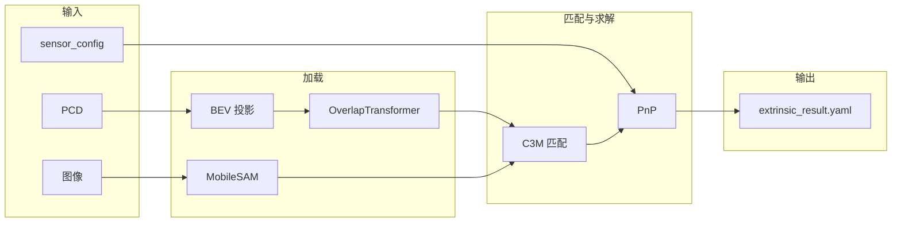

# MIAS-LCEC 工程深入分析：模型加载、推理与优化

## 一、Executive Summary

| 维度 | 官方 MIAS-LCEC | UniCalib 集成（当前） | 建议 |
|------|----------------|------------------------|------|
| **运行方式** | GUI：zvision (C++) + c3m (Python)，ROS2 通信 | Headless：纯 Python 脚本或 .so 调用 | 优先修 .so 环境；否则完善纯 PyTorch |
| **模型加载** | .so 内部 + config.json（conda/sam 路径） | 先 LcMatch_CApi.so，失败则 PyTorch 自实现 | 统一走 PyTorch 时可省略 .so 依赖 |
| **推理链路** | C++ 点云/图像 → ROS2 → c3m → LcMatch_CApi.so → 分割/匹配/PnP | PCD/图像 → BEV → OverlapTransformer → SAM → C3M → PnP | 对齐 BEV/特征尺寸，控制内存 |
| **权重文件** | 官方仅配置 MobileSAM（config.json 仅含 sam 路径），.so 内部未公开 | UniCalib 纯 PyTorch 路径引入 `pretrained_overlap_transformer.pth.tar`（BEV 特征）+ `mobile_sam.pt` | 官方工程不使用 .pth.tar，仅用 SAM |

---

## 二、MIAS-LCEC 官方工程架构

### 2.1 程序组成（来自 [program.md](https://github.com/ZWhuang666/MIAS-LCEC/blob/main/doc/program.md)）

```
┌─────────────────────────────────────────────────────────────────────────┐
│  mias_lcec.sh                                                            │
│  /bin/python3 bin/python/c3m.py  &   bin/C/zvision                       │
└─────────────────────────────────────────────────────────────────────────┘
        │                                        │
        ▼                                        ▼
┌───────────────────┐                  ┌───────────────────┐
│  c3m (Python)     │   ROS2 话题      │  zvision (C++)    │
│  - LcMatch_CApi   │ ◄──────────────► │  - 主 UI          │
│  - 分割/跨模态匹配 │  发布/订阅        │  - 点云/图像加载   │
│  - 结果回传       │                  │  - 标定结果展示   │
└───────────────────┘                  └───────────────────┘
```

- **zvision**：C++ 包，主界面、点云/图像浏览、标定触发、结果可视化。
- **c3m**：Python 包，接收 zvision 通过 ROS2 发来的命令与数据，执行**分割**与**跨模态 mask 匹配 (C3M)**，将匹配点对回传给 zvision 做 PnP 求解。

因此官方**没有**提供“单次输入 pcd + image → 输出外参”的 headless 文件接口；一切通过 ROS2 与 GUI 交互。

### 2.2 官方模型与配置

- **安装与配置**（[installation.md](https://github.com/ZWhuang666/MIAS-LCEC/blob/main/doc/installation.md)）：
  - 需 **Python 3.10**、PyTorch、**MobileSAM**（`pip install -e .` 在 `bin/MobileSAM` 或 `pip install git+https://github.com/ChaoningZhang/MobileSAM.git`）、timm。
  - 运行 `python config.py` 生成 `bin/python/config.json`，写入 conda site-packages 路径与 `sam`（MobileSAM 目录）。
- **模型文件**（以官方仓库为准）：
  - 官方 **仅** 配置并文档化 **MobileSAM**：`config.py` / `config.json` 只写入 `sam` 路径（`bin/MobileSAM`），安装说明仅要求安装 MobileSAM 与 timm，**未**提及 Overlap Transformer 或 `pretrained_overlap_transformer.pth.tar`。
  - 图像分割权重：`bin/MobileSAM/weights/mobile_sam.pt` 或项目内 `model/mobile_sam.pt`。
  - **说明**：`model/pretrained_overlap_transformer.pth.tar` 是 **UniCalib 侧** 为纯 PyTorch 粗标定（BEV + OverlapTransformer + C3M + PnP）自行引入的，**非**官方 MIAS-LCEC 工程所用。
- **c3m.py 入口**（本仓库 `MIAS-LCEC/bin/python/c3m.py`）：

```python
import os
path = os.path.abspath(os.path.dirname(__file__))
import sys
sys.path.append(path)
from LcMatch_CApi import*
def main():
    LcMatchCApi()
if __name__ == "__main__":
    LcMatchCApi()
```

即：**仅启动 `LcMatchCApi()`**，无命令行参数（如 `--pcd`/`--image`）。所有输入输出通过 ROS2 与 zvision 交互。模型加载与推理均在 **LcMatch_CApi**（.so）及 **envpath**（.so）内部完成；**envpath.so 会向 `bin/ResImg/` 写入**，若目录只读则报 `Read-only file system`。

---

## 三、UniCalib 侧的模型加载与推理

### 3.1 调用链

```
ai_coarse_calib.cpp (C++)
    → 调 run_lidar_cam_coarse.py（--pcd, --image, --sensor_config, --output_dir, --model_path, --mias_repo）
        → mias_lcec_infer.try_mias_infer(pcd, image, sensor_config, model_path, mias_repo)
            ├─ 路径1：sys.path 加入 mias_repo / MIAS-LCEC/bin / MIAS-LCEC/bin/python，import("c3m") 或 import("LcMatch_CApi")
            │       → 若 LcMatch_CApi 暴露 estimate_extrinsic/infer 则调用；否则路径1 失败
            │       → 导入时 envpath.so 会访问 MIAS-LCEC/bin/ResImg/，只读则 OSError
            └─ 路径2：.so 不可用时 _try_self_contained_pytorch_infer()
                    → _try_pure_pytorch_infer() → mias_lcec_pytorch.coarse_calib.MIASLCECCoarseCalib
```

### 3.2 纯 PyTorch 模型加载（当前实现）

- **入口**：`calib_unified/scripts/mias_lcec_pytorch/coarse_calib.py` 中 `MIASLCECCoarseCalib._lazy_init()`。
- **Overlap Transformer**（`overlap_transformer.load_overlap_transformer`）：
  1. `torch.load(checkpoint_path)`，取 `state_dict`（或 `checkpoint["model"]`）。
  2. 去掉 `module.` 前缀，并按 MIAS 命名做 key 映射（conv1/bn1/layer1… → `feature_extractor.*`）。
  3. 根据 conv 形状判断 **legacy** 或 **use_mias_official**：
     - 若 `feature_extractor.layer1.0.conv.weight` 为 `(32, 16, 3, 1)` 则 `use_mias_official=True`。
  4. **若 use_mias_official**：只加载 `k.startswith("feature_extractor.")` 的权重；**pos_embed、transformer.* 不加载**（官方 checkpoint 与当前 BEV 尺寸不一致，会报 shape 不匹配），因此这些层为**随机初始化**。
  5. 若否，则 `load_state_dict(..., strict=False)`，缺失键会告警。

因此：**当前“加载”的是 backbone（feature_extractor），Transformer 与 pos_embed 为随机初始化**，对精度有影响；若官方未开放与当前 BEV 尺寸一致的 pos_embed/transformer 权重，只能接受仅 backbone 有效或后续自行训练/微调。

- **MobileSAM**：`mobile_sam_wrapper.create_sam_wrapper(checkpoint_path, device, use_fallback=True)`。
  - 若已安装 `mobile_sam` 包且有权重：用 `SamPredictor` 做分割与特征。
  - 否则用 **SimplifiedMobileSAM**（如 SLIC 超像素），效果差一档。

### 3.3 纯 PyTorch 推理流程（estimate_extrinsic）

```
1) 加载 PCD、图像
2) 点云 → BEV 投影（BEVConfig：resolution/width/height/height_range）
3) BEV → OverlapTransformer.extract_features(bev) → global_feat, local_feat
4) 图像 → SAM 分割 → masks, image_features
5) 用 BEV 元数据与 local_feat 构造 lidar_points_for_c3m（与特征格点一一对应）
6) C3MMatcher.match(lidar_features, image_features, lidar_points, masks, K, initial_rt) → obj_pts, img_pts, inlier_mask
7) cv2.solvePnPRansac(obj_pts, img_pts, K, dist) → R, t
```

若 3/4/5 任一步不可用（例如 SAM 未装、local_feat 为空、mask 为空），会提前返回 None，不执行 PnP。

---

## 四、当前问题与根因（与计划一致）

| 问题 | 根因 | 影响 |
|------|------|------|
| Read-only file system: `.../MIAS-LCEC/bin/ResImg/` | envpath.so 从自身路径解析 ResImg，不读 EXE_ABS_PATH；Docker 挂载 MIAS-LCEC 为 `:ro` | 无法导入 LcMatch_CApi，只能走纯 PyTorch |
| OverlapTransformer 缺失 29 键 | 官方 checkpoint 仅含 backbone；pos_embed/transformer 与 BEV 尺寸绑定，代码仅加载 feature_extractor | 后端 Transformer 为随机 init，特征质量受限 |
| MobileSAM 包未安装 | 未执行 `pip install -e .` 或 `pip install git+https://.../MobileSAM.git` | 使用 SimplifiedMobileSAM，分割与特征弱 |
| GPU sm_120 不兼容 | PyTorch 未支持 RTX 50 系 | 回退 CPU，速度慢、易 OOM |
| exit_code=137 | CPU 下 BEV+SAM+C3M 内存大，被 OOM Killer 杀进程 | 粗标定子进程无输出 |

---

## 五、优化建议（按优先级）

### 5.1 环境与运行方式（P0）

1. **MIAS-LCEC 目录可写**  
   - 已做：`calib_unified_run.sh` 中 MIAS-LCEC 挂载由 `:ro` 改为 `:rw`。  
   - 建议：宿主机/容器内保证 `MIAS-LCEC/bin/ResImg` 存在且可写（如 `mkdir -p bin/ResImg && chmod 777 bin/ResImg`），以便需要时可用 .so 路径。

2. **安装 MobileSAM**  
   - 在**实际运行粗标定的环境**（如 Docker 内或同一 Python 环境）中：  
     `pip install git+https://github.com/ChaoningZhang/MobileSAM.git`  
     或进入 `MIAS-LCEC/bin/MobileSAM` 执行 `pip install -e .`。  
   - 这样纯 PyTorch 路径也会用真实 SAM 分割与特征，提高匹配质量。

3. **PyTorch 与 GPU**  
   - 若为 RTX 50 系：等 PyTorch 官方支持 sm_120 或使用支持该架构的 nightly；在此之前用 CPU 时需配合下面内存优化。

### 5.2 模型加载与结构（P1）

4. **明确“仅 backbone”的语义**  
   - 在 `load_overlap_transformer` 或调用处打日志：明确说明“仅加载 feature_extractor，pos_embed/transformer 为随机初始化，仅作粗特征使用”。  
   - 若有官方提供的、与当前 BEV 尺寸一致的完整 checkpoint，再扩展加载 pos_embed/transformer。

5. **BEV 尺寸与 checkpoint 一致**  
   - 若官方训练时固定了 BEV 分辨率（如 1024×1024 或其它），保证 `BEVConfig.width/height` 与之一致，避免 feature 空间尺寸对不齐。

6. **MobileSAM 权重路径**  
   - 当前在 `mias_lcec_infer._try_pure_pytorch_infer` 中会从 `model_path` 所在目录找 `mobile_sam.pt`，以及若干固定路径。  
   - 建议在配置或环境变量中支持显式指定 MobileSAM 权重路径（如 `MOBILESAM_CHECKPOINT`），避免多环境路径不一致。

### 5.3 内存与稳定性（P0）

7. **降低 BEV 分辨率**  
   - 在 CPU 或内存紧张时，将 `BEVConfig` 的 `width/height` 从 1024 降到 512 或 256，可显著减少 BEV 和后续特征的内存。

8. **延迟加载与释放**  
   - 已用 `_lazy_init()` 延迟加载 OverlapTransformer 和 SAM；可在每步推理后对不用的中间大 tensor 执行 `del` 并适时 `torch.cuda.empty_cache()`（若用 GPU）。

9. **全程 no_grad**  
   - 推理路径已用 `@torch.no_grad()`（如 OverlapTransformer.extract_features）；确保 BEV→特征→C3M 整条链路无多余梯度，减少显存/内存。

10. **子进程内存上限**  
    - 若在 Docker 内跑，可对粗标定子进程设内存限制（如 `ulimit` 或 cgroup），避免拖垮整机；或由 C++ 侧限制子进程最大内存并捕获 137 做友好提示。

### 5.4 鲁棒性与可观测性（P2）

11. **C3M 匹配失败时的回退**  
    - 当 C3M 匹配点数 &lt; 6 或 PnP 失败时，可显式回退到“几何 PnP 初值”（与 run_lidar_cam_coarse 的 PnP 分支一致），并在日志中注明“纯 PyTorch 匹配失败，使用几何回退”。

12. **日志与诊断**  
    - 在关键步骤打印：BEV shape、特征 shape、匹配对数、PnP 内点数、最终 R/t。  
    - 便于在“未使用深度模型”或“identity”时快速判断是 .so 不可用、SAM 未装、还是 C3M/PnP 失败。

---

## 六、数据流小结（Mermaid）



- **Overlap Transformer 权重**：仅 **feature_extractor** 从 `pretrained_overlap_transformer.pth.tar` 加载；**pos_embed / transformer** 为当前代码初始化（随机或零），与官方训练时的 BEV 分辨率不一致时不加载。
- **推理**：BEV → OT 特征 → 与 SAM 的 mask 特征做 C3M → 得到 3D-2D 对应 → PnP 得到 R、t。

---

## 七、总结

- **官方 MIAS-LCEC**：GUI + ROS2，模型在 **LcMatch_CApi / envpath** 等 .so 内加载，**无标准 headless 文件接口**；依赖 **Python 3.10**、**ResImg 可写**、**MobileSAM 安装**。
- **UniCalib**：通过 `try_mias_infer` 先尝试 .so，再回退到**纯 PyTorch**（BEV + OverlapTransformer backbone + SAM + C3M + PnP）。
- **模型加载**：当前仅 Overlap Transformer 的 **backbone** 来自官方权重；**pos_embed/transformer 未在 checkpoint 中提供或尺寸不一致**，需接受随机初始化或后续用自有数据微调。
- **优化重点**：环境上保证 ResImg 可写、安装 MobileSAM、必要时升级/适配 PyTorch；实现上降低 BEV 分辨率、控制内存、明确“仅 backbone”的语义，并做好 C3M/PnP 失败时的回退与日志，便于排查“未使用深度模型”或 identity 的原因。
